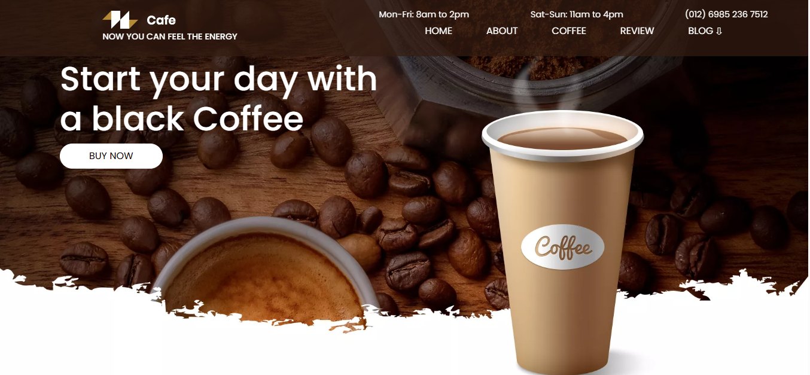

# ☕ Coffee Shop Website

A modern, responsive, and visually appealing coffee shop website built using **HTML5**, **CSS3**, and **Bootstrap 5**. This project showcases a fictional café's online presence with engaging sections and interactive elements.

## 🌐 Live Demo

👉 [View Live Website](https://insharahdeveloper.github.io/Coffee-Shop-Website/)

---

## 🧑‍💻 Developer Information

- **Name:** Insharah Irfan  
- **GitHub:** [@InsharahDeveloper](https://github.com/InsharahDeveloper)

---

## 📸 Project Preview

### 🖼️ Screenshot

## 🚀 Features

- Responsive design for all devices  
- Hero section with a strong call-to-action  
- About section for story and mission  
- Menu section for coffee items  
- Live coffee making highlight  
- Customer testimonials  
- Blog/articles section  
- Newsletter subscription form  
- Social media links in the footer  

---

## 🛠️ Technologies Used

- HTML5  
- CSS3  
- Bootstrap 5  
- Google Fonts (`Poppins`, `Aboreto`)  
- Remix Icon  
- AOS (Animate On Scroll)

